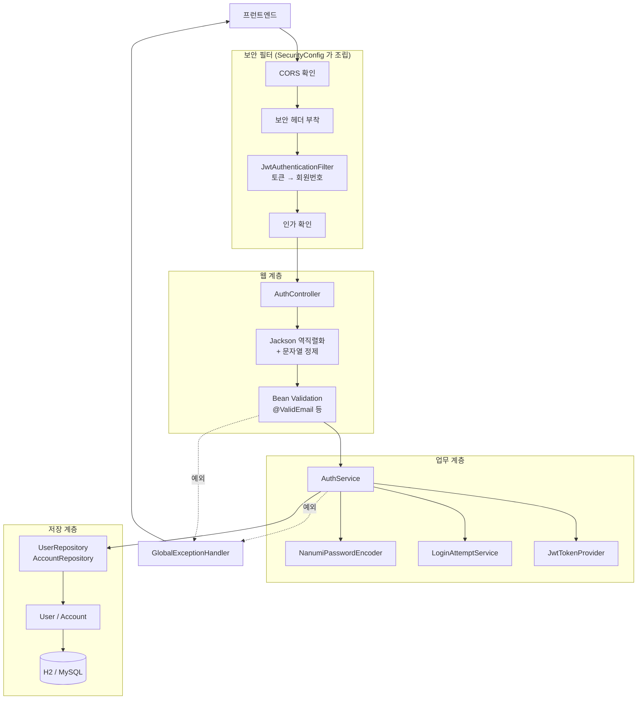
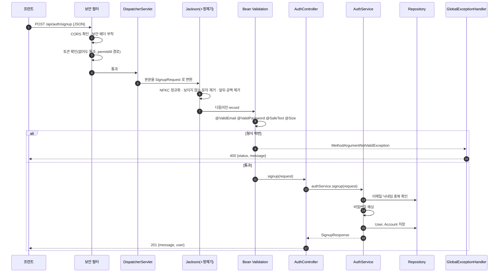
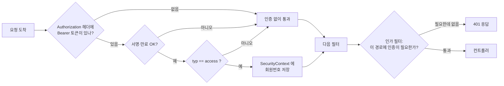
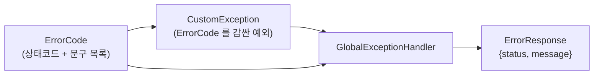
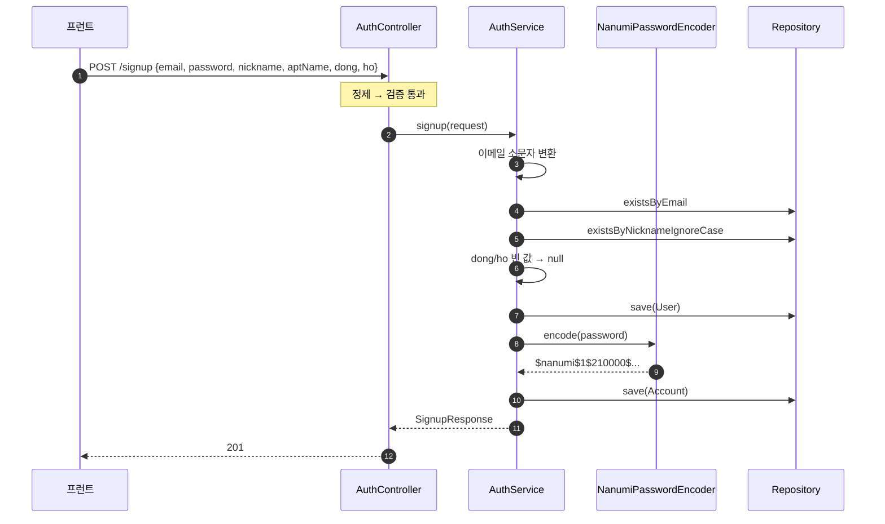
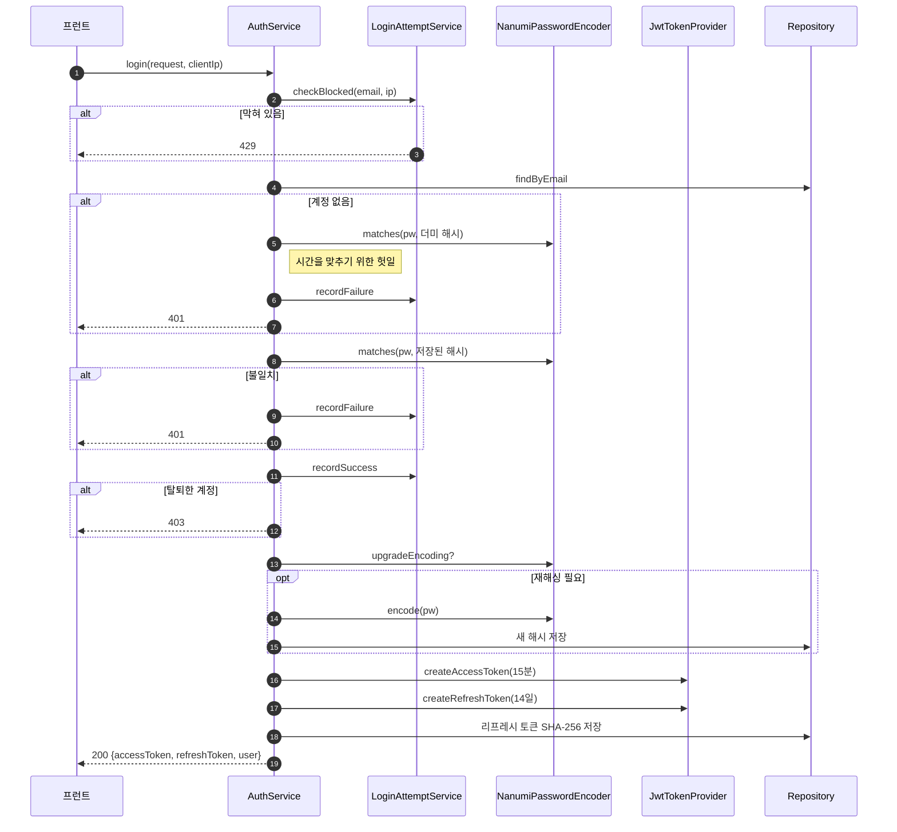
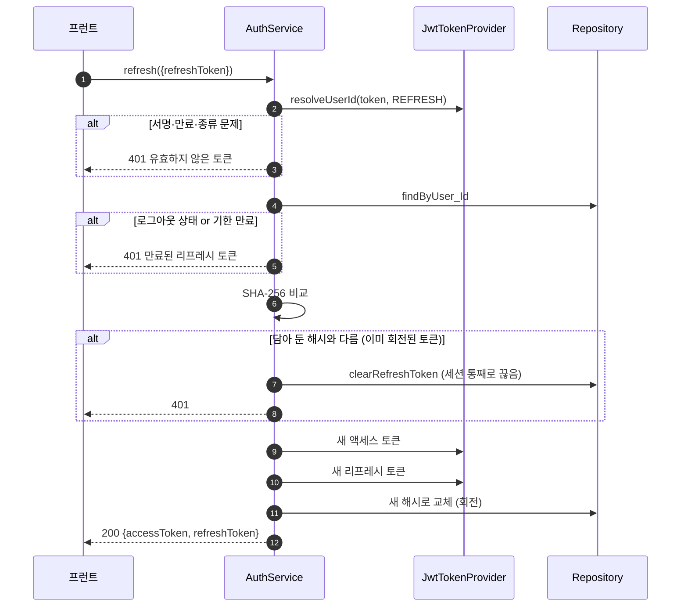
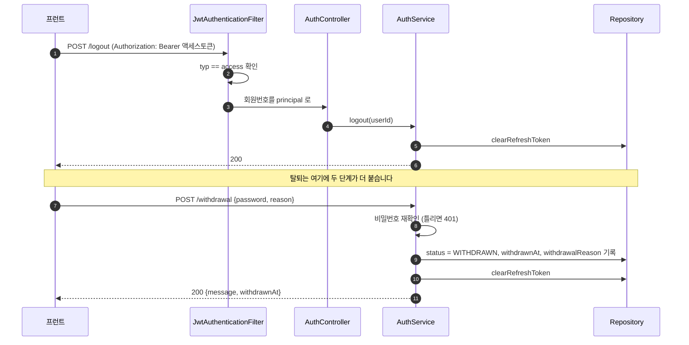
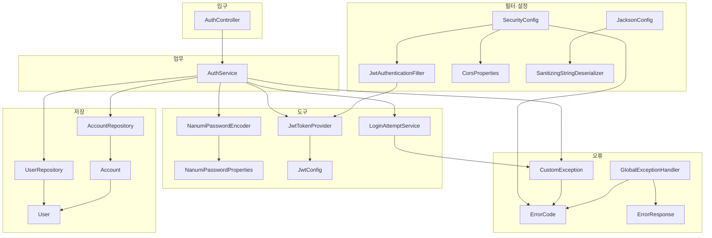

# 나누미 백엔드 코드 안내

이 문서는 `backend/api` 의 코드를 **처음 보는 사람이 순서대로 따라 읽을 수 있게** 정리한 것입니다.
클래스마다 "무엇을 하는가"뿐 아니라 "왜 이렇게 되어 있는가", "누가 누구를 부르는가"까지 적었습니다.

- 기준 코드: `feat/62-backend-implement`
- 구현 범위: 회원가입 / 로그인 / 토큰 재발급 / 로그아웃 / 회원탈퇴
- 기술 스택은 [architecture.md](architecture.md) 참고

읽는 순서 추천: **1장 → 2장 → 4장(시나리오) → 3장(파일별 상세)**
전체 구조를 먼저 잡고, 궁금한 파일만 3장에서 찾아보는 방식이 빠릅니다.

---

## 0. 30초 요약

```
회원은 이메일 + 비밀번호로 가입하고 로그인합니다.
로그인에 성공하면 액세스 토큰(15분)과 리프레시 토큰(14일)을 받습니다.
액세스 토큰으로 API 를 부르고, 만료되면 리프레시 토큰으로 다시 받습니다.
비밀번호는 PBKDF2 로 해싱해서 저장하고, 리프레시 토큰은 SHA-256 해시만 저장합니다.
```

| 엔드포인트 | 인증 필요 | 하는 일 |
| --- | --- | --- |
| `POST /api/auth/signup` | ✗ | 회원가입 |
| `POST /api/auth/login` | ✗ | 로그인, 토큰 2종 발급 |
| `POST /api/auth/refresh` | ✗ (리프레시 토큰을 본문으로) | 토큰 2종 재발급 |
| `POST /api/auth/logout` | ✓ | 리프레시 토큰 무효화 |
| `POST /api/auth/withdrawal` | ✓ | 회원탈퇴 (Soft Delete) |

---

## 1. 전체 지도

### 1-1. 디렉터리와 역할

```
com/nanumi/api
├─ ApiApplication.java          시작점
│
├─ config/                      설정 (스프링이 뜰 때 한 번 읽고 끝)
│   ├─ SecurityConfig.java          필터 체인, 보안 헤더, CORS, 인증 실패 응답
│   ├─ JwtConfig.java               jwt.* 설정값
│   ├─ CorsProperties.java          nanumi.security.cors.* 설정값
│   └─ JacksonConfig.java           문자열 정제기를 Jackson 에 끼워 넣음
│
├─ controller/                  입구 (HTTP 만 다루고 판단은 안 함)
│   └─ AuthController.java
│
├─ dto/                         주고받는 데이터 모양 (전부 record, 불변)
│   ├─ request/                     들어오는 것 + 검증 어노테이션
│   └─ response/                    나가는 것
│
├─ validation/                  입력 형식 검사
│   ├─ annotation/                  @ValidEmail @ValidPassword @ValidNickname @SafeText
│   └─ validator/                   각 어노테이션의 실제 검사 로직
│
├─ service/                     판단하는 곳 (여기에만 업무 규칙이 있음)
│   └─ AuthService.java
│
├─ security/                    인증·보안 도구
│   ├─ JwtTokenProvider.java        토큰 발급/검증
│   ├─ JwtAuthenticationFilter.java 요청마다 토큰 확인
│   ├─ LoginAttemptService.java     로그인 무차별 대입 차단
│   ├─ password/                    비밀번호 해싱
│   └─ xss/                         요청 문자열 공통 정제
│
├─ entity/                      DB 테이블 (상태를 바꾸는 메서드도 여기)
│   ├─ User.java                    사람 정보
│   └─ Account.java                 로그인 자격 증명
│
├─ repository/                  DB 접근 (인터페이스만, 구현은 스프링이 만듦)
│
└─ exception/                   오류 처리
    ├─ ErrorCode.java               오류 목록 (상태코드 + 문구)
    ├─ CustomException.java         우리가 일부러 던지는 예외
    └─ GlobalExceptionHandler.java  모든 예외를 같은 JSON 모양으로 변환
```

### 1-2. 계층 그림



### 1-3. 계층별 규칙 (이것만 지키면 구조가 안 무너집니다)

| 계층 | 해도 되는 것 | 하면 안 되는 것 |
| --- | --- | --- |
| Controller | HTTP 를 벗겨 서비스에 넘기기, 상태코드 정하기 | 조건 분기, DB 접근 |
| Service | 업무 규칙 판단, 트랜잭션 경계 | HTTP 개념(`HttpServletRequest` 등) 알기 |
| Entity | 자기 상태 바꾸기(`withdraw()` 등) | 다른 테이블 조회 |
| Repository | 조회 조건 정의 | 로직 |
| Validation | 형식(모양) 검사 | DB 를 봐야 아는 검사(중복 등) — 그건 Service 몫 |

> 예: "이메일 형식이 맞는가"는 `EmailValidator`, "이미 가입된 이메일인가"는 `AuthService` 입니다.

---

## 2. 요청 하나가 지나가는 길

`POST /api/auth/signup` 을 예로 든 전체 경로입니다.



### 2-1. 어디서 무엇이 걸러지는가

같은 "잘못된 입력"이라도 걸러지는 지점이 다릅니다. 이 표가 이 프로젝트 보안의 뼈대입니다.

| 순서 | 담당 | 걸러내는 것 | 실패하면 |
| --- | --- | --- | --- |
| 1 | `corsConfigurationSource` | 허용 목록에 없는 출처 | 브라우저가 차단 |
| 2 | `SecurityConfig.headers` | (차단이 아니라 헤더 부착) CSP·HSTS 등 | — |
| 3 | `JwtAuthenticationFilter` | 서명 위조, 만료, **리프레시 토큰으로 API 호출** | 인증 없이 통과 → 4번에서 걸림 |
| 4 | `authorizeHttpRequests` | 인증이 필요한 경로에 인증 없이 접근 | **401** (`authenticationEntryPoint`) |
| 5 | `SanitizingStringDeserializer` | 전각 문자, 보이지 않는 문자, 앞뒤 공백 | 차단이 아니라 **다듬음** |
| 6 | `@ValidEmail` `@ValidPassword` `@SafeText` `@Size` | 형식 위반, HTML 태그·스크립트 주소 | **400** |
| 7 | `LoginAttemptService` | 반복 로그인 실패 | **429** |
| 8 | `NanumiPasswordEncoder.matches` | 비밀번호 불일치 | **401** |
| 9 | `AuthService` | 중복 가입, 탈퇴 계정 | **409 / 403** |
| 10 | DB 유니크 제약 (`uk_*`) | 9번을 동시 요청으로 뚫고 들어온 중복 | **409** |

> 5번과 6번이 짝입니다. 정제기가 먼저 값을 깨끗하게 만들어 두기 때문에, 검증기는 "보이지 않는 문자가 끼어 있어서 통과했다" 같은 구멍을 걱정하지 않아도 됩니다.
> 9번과 10번도 짝입니다. 9번은 친절한 안내용, 10번은 동시 요청 대비용입니다.

---

## 3. 파일별 상세

### 3-1. 시작점과 설정

#### `ApiApplication.java`

```java
@SpringBootApplication   // (1)
@EnableJpaAuditing       // (2)
public class ApiApplication {
  public static void main(String[] args) {
    SpringApplication.run(ApiApplication.class, args);
  }
}
```

1. 이 패키지(`com.nanumi.api`) 아래를 전부 훑어서 `@Component` `@Service` `@Repository` `@Configuration` 이 붙은 클래스를 빈으로 등록합니다. 그래서 새 클래스를 만들 때 이 패키지 안에만 두면 따로 등록할 게 없습니다.
2. `@CreatedDate` `@LastModifiedDate` 를 동작하게 합니다. **이게 없으면** `User.createdAt` 이 `null` 인 채로 저장되려다 `nullable = false` 에 걸려 터집니다.

#### 설정값 클래스 3개

셋 다 같은 방식입니다. `application.yml` 의 특정 구간을 자바 객체로 받아 둡니다.

| 클래스 | yml 경로 | 담는 값 |
| --- | --- | --- |
| `JwtConfig` | `jwt.*` | 키 파일 위치, 액세스/리프레시 만료 시간 |
| `NanumiPasswordProperties` | `nanumi.security.password.*` | PBKDF2 반복 횟수, pepper |
| `CorsProperties` | `nanumi.security.cors.*` | 허용 출처·메서드·헤더 |

```java
@Getter @Setter                                        // 스프링이 setter 로 값을 채움
@Component                                             // 빈으로 등록
@ConfigurationProperties(prefix = "nanumi.security.password")  // yml 의 이 구간을 읽음
public class NanumiPasswordProperties {
  private int iterations = 210_000;   // yml 에 없으면 이 기본값
  private String pepper = "";
}
```

> yml 의 `kebab-case` 가 자바의 `camelCase` 로 자동 매칭됩니다. `access-token-expiration` ↔ `accessTokenExpiration`.

#### `JacksonConfig.java`

```java
@Bean
public JacksonModule sanitizingStringModule() {
  SimpleModule module = new SimpleModule("nanumi-sanitizing-string");
  module.addDeserializer(String.class, new SanitizingStringDeserializer());  // (1)
  return module;                                                            // (2)
}
```

1. **모든 `String` 필드**의 역직렬화를 우리 정제기로 바꿔 끼웁니다. DTO 마다 붙일 필요가 없습니다.
2. `JacksonModule` 타입의 빈을 만들어 두면 스프링 부트가 알아서 `JsonMapper` 에 등록합니다. 우리가 등록 코드를 쓸 필요가 없습니다.

---

### 3-2. `SecurityConfig.java` — 필터 체인 조립

이 파일이 **요청이 컨트롤러에 닿기 전까지의 모든 것**을 정합니다.

#### 체인이 두 개인 이유

```java
@Bean
@Order(Ordered.HIGHEST_PRECEDENCE)   // 먼저 검사
@Profile("dev")                      // 개발 프로필에서만 존재
public SecurityFilterChain h2ConsoleFilterChain(HttpSecurity http) {
  http.securityMatcher("/h2-console/**")                                   // (1)
      .csrf(csrf -> csrf.disable())
      .headers(headers -> headers.frameOptions(frame -> frame.sameOrigin())) // (2)
      .authorizeHttpRequests(auth -> auth.anyRequest().permitAll());
}
```

1. `securityMatcher` 로 **이 체인이 맡을 경로를 한정**합니다. `/h2-console/**` 만 여기로 옵니다.
2. H2 콘솔은 화면을 `iframe` 으로 그립니다. 그래서 `frameOptions` 를 `sameOrigin` 으로 풀어 줘야 합니다.

**왜 체인을 나눴는가**: `frameOptions` 를 풀어 준 설정을 API 체인에 같이 두면, 운영에서도 우리 페이지가 남의 사이트 `iframe` 안에 들어갈 수 있게 됩니다(클릭재킹). `@Profile("dev")` 를 붙여 **운영에는 이 빈 자체가 만들어지지 않도록** 했습니다.

#### API 체인 한 줄씩

```java
http.csrf(csrf -> csrf.disable())                                  // (1)
    .cors(cors -> cors.configurationSource(corsConfigurationSource)) // (2)
    .sessionManagement(s -> s.sessionCreationPolicy(STATELESS))     // (3)
    .authorizeHttpRequests(auth ->
        auth.requestMatchers("/api/auth/signup",
                             "/api/auth/login",
                             "/api/auth/refresh").permitAll()       // (4)
            .anyRequest().authenticated())                          // (5)
    .headers(...)                                                   // (6)
    .exceptionHandling(...)                                         // (7)
    .addFilterBefore(new JwtAuthenticationFilter(jwtTokenProvider),
                     UsernamePasswordAuthenticationFilter.class);   // (8)
```

1. **CSRF 끔.** CSRF 공격은 브라우저가 쿠키를 자동으로 실어 보내기 때문에 성립합니다. 우리는 토큰을 `Authorization` 헤더에 직접 넣으므로 자동 전송이 없고, 따라서 CSRF 토큰이 필요 없습니다.
2. 아래 `corsConfigurationSource` 빈을 연결합니다.
3. **세션을 아예 만들지 않습니다.** 로그인 상태를 서버가 기억하지 않고 토큰으로만 판단합니다(무상태). 서버를 여러 대로 늘릴 때 유리합니다.
4. 이 3개는 토큰 없이 부를 수 있어야 합니다. 로그인 전에 부르는 API 이기 때문입니다. `refresh` 가 여기 있는 이유는, 액세스 토큰이 만료된 상태에서 부르는 API 라서입니다.
5. 나머지는 전부 인증 필요. **새 API 를 추가하면 자동으로 인증 대상**이 됩니다(안전한 기본값).
6. 보안 헤더 5종. 아래 표 참고.
7. 인증/인가 실패 시 응답 모양을 정합니다.
8. 우리 토큰 필터를 스프링 시큐리티 기본 로그인 필터 **앞에** 끼워 넣습니다.

#### 보안 헤더 5종

| 헤더 | 값 | 막는 것 |
| --- | --- | --- |
| `Content-Security-Policy` | `default-src 'none'; ...` | 응답이 어쩌다 HTML 로 해석돼도 스크립트가 안 돌게 |
| `X-Frame-Options` | `DENY` | 클릭재킹 (남의 사이트 iframe 안에 넣기) |
| `Referrer-Policy` | `no-referrer` | 이동할 때 우리 URL 이 남의 서버 로그에 남는 것 |
| `Permissions-Policy` | `geolocation=(), camera=(), ...` | 브라우저 기능 오남용 |
| `Strict-Transport-Security` | `max-age=1년; includeSubDomains` | HTTP 로 접속하는 것 자체 |

#### 인증 실패 응답을 직접 쓰는 이유

```java
private static void writeError(HttpServletResponse response, ErrorCode errorCode) {
  response.setStatus(errorCode.getStatus().value());
  response.setContentType("application/json");
  response.setCharacterEncoding(StandardCharsets.UTF_8.name());
  response.getWriter()
      .write("{\"status\":%d,\"message\":\"%s\"}".formatted(...));
}
```

필터는 **컨트롤러보다 앞**에 있어서 `@RestControllerAdvice` 가 잡지 못합니다. 그래서 여기서 JSON 을 직접 씁니다. 형식은 `ErrorResponse` 와 똑같이 맞춰서, 프런트가 `error.response.data.message` 하나만 보면 되도록 했습니다.

---

### 3-3. `JwtTokenProvider.java` — 토큰 발급과 검증

#### 키를 언제 읽는가

```java
@PostConstruct
private void init() throws IOException, GeneralSecurityException {
  this.privateKey = readPrivateKey(jwtConfig.getPrivateKeyPath());
  this.publicKey = readPublicKey(jwtConfig.getPublicKeyPath());
}
```

빈이 만들어진 직후 **딱 한 번** 읽습니다. 요청마다 파일을 읽지 않습니다.
**키 파일이 없으면 여기서 애플리케이션이 뜨지 않습니다.** 클론 직후 실행이 안 되는 것도 이 때문이고, `ApiApplicationTests` 가 이 상황을 잡아 줍니다.

#### 토큰 만들기

```java
private String createToken(Long userId, TokenType type, long expiration) {
  Date now = new Date();
  Date expiry = new Date(now.getTime() + expiration);

  return Jwts.builder()
      .subject(String.valueOf(userId))          // (1)
      .id(UUID.randomUUID().toString())         // (2)
      .claim(TOKEN_TYPE_CLAIM, type.value())    // (3)
      .issuedAt(now)
      .expiration(expiry)                       // (4)
      .signWith(privateKey, Jwts.SIG.RS256)     // (5)
      .compact();
}
```

1. `subject` 에 회원번호. 나중에 `claims.getSubject()` 로 꺼냅니다.
2. `jti` — 토큰마다 다른 값. 같은 순간에 두 번 발급해도 서로 다른 토큰이 나옵니다. (지금은 쓰지 않지만, 나중에 토큰 하나만 콕 집어 무효화할 때 씁니다.)
3. **`typ` 클레임 — 이 프로젝트에서 가장 중요한 한 줄.** `"access"` 또는 `"refresh"`.
4. 만료 시각. 액세스는 15분, 리프레시는 14일.
5. **개인키**로 서명(RS256). 검증은 공개키로 합니다.

> **왜 `typ` 이 중요한가**
> 이게 없으면 두 토큰의 내용이 만료 시간만 빼고 완전히 같아집니다. 그러면 `Authorization: Bearer {리프레시 토큰}` 으로 보내도 필터가 그대로 통과시킵니다.
> 즉 **리프레시 토큰이 14일짜리 액세스 토큰이 되어**, 액세스 토큰을 15분으로 짧게 잡은 의미가 통째로 사라집니다.
> 이 동작은 `AuthFlowIntegrationTest.리프레시_토큰으로는_API를_못_부름()` 이 지키고 있습니다.

#### 토큰 읽기

```java
public Optional<Long> resolveUserId(String token, TokenType expectedType) {
  if (token == null || token.isBlank()) return Optional.empty();     // (1)

  try {
    Claims claims = parseClaims(token);                              // (2)

    if (!expectedType.value().equals(claims.get(TOKEN_TYPE_CLAIM, String.class))) {
      return Optional.empty();                                       // (3)
    }
    return Optional.of(Long.valueOf(claims.getSubject()));           // (4)
  } catch (JwtException | IllegalArgumentException e) {
    return Optional.empty();                                         // (5)
  }
}
```

1. 토큰이 아예 없는 경우. 헤더가 없는 요청도 여기로 옵니다.
2. `parseClaims` 안에서 **서명 확인과 만료 확인이 동시에** 일어납니다. 둘 중 하나라도 틀리면 예외가 납니다.
3. 서명은 맞지만 **종류가 다른** 경우. 리프레시 토큰을 API 에 쓴 상황이 여기서 걸립니다.
4. 전부 통과. 회원번호를 돌려줍니다.
5. 실패 이유를 나눠서 알려 주지 않습니다. "서명이 틀렸다"와 "만료됐다"를 구분해서 알려 주면 공격자에게 힌트가 됩니다.

> **`Optional` 을 쓰는 이유**: 예전에는 `validateToken()` 으로 확인하고 `getUserId()` 로 다시 꺼내느라 **같은 토큰을 두 번 파싱**했습니다. RSA 서명 검증은 싼 연산이 아니라서 한 번으로 합쳤습니다.

---

### 3-4. `JwtAuthenticationFilter.java` — 요청마다 도는 문지기

```java
@Override
protected void doFilterInternal(HttpServletRequest request,
                                HttpServletResponse response,
                                FilterChain filterChain) {
  jwtTokenProvider
      .resolveUserId(resolveToken(request), TokenType.ACCESS)        // (1)
      .ifPresent(userId ->                                           // (2)
          SecurityContextHolder.getContext().setAuthentication(
              new UsernamePasswordAuthenticationToken(
                  userId, null, Collections.emptyList())));          // (3)

  filterChain.doFilter(request, response);                           // (4)
}
```

1. `TokenType.ACCESS` 를 넘기는 것이 핵심입니다. 리프레시 토큰은 여기서 `Optional.empty()` 가 됩니다.
2. **토큰이 없거나 틀려도 예외를 던지지 않습니다.** 그냥 인증을 안 넣고 넘어갑니다.
3. 인증 주체(principal)로 **회원번호(`Long`)** 를 넣습니다. → 컨트롤러에서 `@AuthenticationPrincipal Long userId` 로 바로 받습니다.
4. 무조건 다음 필터로 넘깁니다.

> **왜 여기서 401 을 던지지 않는가**
> `/api/auth/login` 같은 공개 경로는 토큰이 없는 게 정상입니다. 여기서 막으면 로그인을 할 수 없습니다.
> "인증이 필요한가"를 판단하는 건 뒤에 있는 인가 필터(`authorizeHttpRequests`)의 몫입니다. 이 필터는 **토큰이 있으면 신원을 붙여 줄 뿐**이고, 그 신원이 필요한지는 다른 곳에서 정합니다. 역할이 깔끔하게 나뉩니다.



---

### 3-5. `NanumiPasswordEncoder.java` — 비밀번호 해싱

스프링 시큐리티의 `PasswordEncoder` 인터페이스를 직접 구현한 클래스입니다.

#### 저장 형식

```
$nanumi$1$210000$ES9dxu6QeMBGl8fA4kR6bw$Xo1r......
 └──┬──┘ │ └─┬──┘ └────────┬─────────┘ └───┬───┘
   이름  버전 반복횟수      salt(22자)      hash(43자)
```

기본 설정에서 정확히 **83자**입니다. `Account.password` 컬럼 길이가 83인 이유가 이것입니다.

#### `encode` — 새로 해싱

```java
public String encode(CharSequence rawPassword) {
  if (rawPassword == null) throw new IllegalArgumentException("비밀번호가 비어 있음");

  byte[] salt = new byte[SALT_BYTES];      // 16바이트
  RANDOM.nextBytes(salt);                  // (1) 매번 새로 뽑음

  int iterations = resolveIterations();    // (2) 현재 설정값
  byte[] hash = pbkdf2(rawPassword, salt, iterations);

  return "$nanumi$" + VERSION + "$" + iterations + "$"
       + base64(salt) + "$" + base64(hash);   // (3)
}
```

1. **salt 를 매번 새로 뽑습니다.** 그래서 같은 비밀번호로 두 명이 가입해도 저장된 해시가 다릅니다. 미리 계산해 둔 표(레인보우 테이블)로 한 번에 뚫는 걸 막습니다.
2. 지금 설정된 반복 횟수를 씁니다.
3. **salt 와 반복 횟수를 해시에 같이 적어 둡니다.** 이게 핵심입니다 — 나중에 반복 횟수를 올려도 기존 계정은 자기 반복 횟수로 검증되므로 **로그인이 막히지 않습니다.**

#### `pbkdf2` — 실제 해싱

```java
private byte[] pbkdf2(CharSequence rawPassword, byte[] salt, int iterations) {
  char[] material = (rawPassword.toString() + properties.getPepper()).toCharArray();  // (1)
  PBEKeySpec spec = new PBEKeySpec(material, salt, iterations, HASH_BYTES * 8);       // (2)
  try {
    return SecretKeyFactory.getInstance(ALGORITHM).generateSecret(spec).getEncoded();
  } catch (...) {
    throw new IllegalStateException("비밀번호 해시를 만들지 못함", e);
  } finally {
    spec.clearPassword();                   // (3)
    Arrays.fill(material, '\0');            // (3)
  }
}
```

1. **pepper**: 서버만 아는 비밀값을 비밀번호 뒤에 붙입니다. salt 는 DB 에 같이 저장되지만 pepper 는 저장되지 않습니다. → **DB 만 통째로 유출돼도** pepper 를 모르면 대입 공격을 할 수 없습니다.
2. PBKDF2 를 21만 번 반복합니다. 사람에게는 0.1초지만, 공격자가 수십억 개를 시도하려면 감당이 안 되는 비용이 됩니다.
3. 다 쓴 뒤 메모리에서 평문을 지웁니다. 메모리 덤프에 남을 시간을 줄입니다.

#### `matches` — 맞춰 보기

```java
public boolean matches(CharSequence rawPassword, String encodedPassword) {
  if (rawPassword == null || encodedPassword == null || encodedPassword.isEmpty())
    return false;

  if (isLegacyHash(encodedPassword))                                    // (1)
    return legacyEncoder.matches(rawPassword, encodedPassword);

  ParsedHash parsed = parse(encodedPassword);                           // (2)
  if (parsed == null) return false;

  byte[] actual = pbkdf2(rawPassword, parsed.salt(), parsed.iterations()); // (3)

  return MessageDigest.isEqual(parsed.hash(), actual);                  // (4)
}
```

1. `$2a$` `$2b$` `$2y$` 로 시작하면 예전 BCrypt 해시입니다. 예전에 가입한 회원도 로그인은 되어야 하므로 검증만은 계속 지원합니다.
2. 저장된 문자열을 6조각으로 쪼갭니다. 형식이 깨져 있으면 `null` → `false`.
3. **저장된 salt 와 저장된 반복 횟수**로 다시 계산합니다. 현재 설정값이 아니라 저장된 값을 쓰는 게 포인트입니다.
4. **`MessageDigest.isEqual` — 상수 시간 비교.** `Arrays.equals` 나 `.equals()` 는 첫 글자가 다르면 바로 끝내서, 응답 시간 차이로 해시를 한 글자씩 알아낼 수 있습니다. 이 메서드는 길이가 같으면 항상 끝까지 비교합니다.

#### `upgradeEncoding` — 다시 해싱해야 하나?

```java
public boolean upgradeEncoding(String encodedPassword) {
  if (encodedPassword == null || encodedPassword.isEmpty()) return false;
  if (isLegacyHash(encodedPassword)) return true;                     // (1)

  ParsedHash parsed = parse(encodedPassword);
  if (parsed == null) return false;                                   // (2)

  return parsed.version() != VERSION                                  // (3)
      || parsed.iterations() < resolveIterations();                   // (4)
}
```

1. BCrypt 해시는 무조건 새 형식으로 갈아탑니다.
2. 못 읽는 해시는 다시 해싱해도 의미가 없습니다.
3. 형식 버전이 올라간 경우.
4. **설정된 반복 횟수보다 낮게 저장된 경우.**

> **언제 불리는가**: `AuthService.login()` 에서 **비밀번호가 맞은 직후에만** 부릅니다. 평문 비밀번호를 알 수 있는 순간이 거기뿐이기 때문입니다.
> 덕분에 `application.yml` 의 `iterations` 를 올려 두기만 하면, 회원들이 로그인할 때마다 알아서 강한 해시로 바뀝니다. 마이그레이션 배치가 필요 없습니다.

---

### 3-6. `LoginAttemptService.java` — 무차별 대입 차단

#### 카운터가 두 개인 이유

```java
private final Counter emailCounter = new Counter(EMAIL_MAX_ATTEMPTS);  // 5회
private final Counter ipCounter    = new Counter(IP_MAX_ATTEMPTS);     // 20회
```

| 카운터 | 임계값 | 막는 공격 |
| --- | --- | --- |
| 이메일 | 5회 | 한 계정을 노리고 비밀번호를 바꿔 가며 시도 |
| IP | 20회 | 한 회선에서 계정을 바꿔 가며 시도 |

**둘 중 하나라도 걸리면 차단**합니다.

> **왜 하나로 묶으면 안 되는가**
> 예전에는 키가 `email|ip` 조합이었습니다. 그러면 **IP 만 바꾸면 카운터가 처음부터 다시 시작**해서, 정작 막고 싶던 "한 명이 IP 를 바꿔 가며 한 계정을 뚫는 공격"이 그대로 통했습니다. 주석의 목표와 코드 동작이 정반대였던 셈입니다.
> IP 임계값을 20으로 넉넉하게 잡은 건, 아파트에서 공유기 하나를 여러 세대가 같이 쓰는 경우 이웃까지 같이 막히면 안 되기 때문입니다.

#### 세 개의 진입점

```java
public void checkBlocked(String email, String clientIp) {   // 로그인 맨 앞에서
  if (isBlocked(email, clientIp))
    throw new CustomException(ErrorCode.LOGIN_ATTEMPT_EXCEEDED);  // → 429
}

public void recordFailure(String email, String clientIp) {  // 비밀번호가 틀렸을 때
  emailCounter.recordFailure(...);   // 둘 다 올림
  ipCounter.recordFailure(...);
}

public void recordSuccess(String email, String clientIp) {  // 비밀번호가 맞았을 때
  emailCounter.clear(...);           // 이메일 쪽만 지움
}
```

> `recordSuccess` 에서 **IP 카운터를 지우지 않는 이유**: 공격자가 자기 계정 하나로 로그인만 성공하면 IP 카운터를 매번 초기화할 수 있게 되기 때문입니다.

#### 메모리가 무한정 늘어나지 않게

```java
private static Map<String, Attempt> createBoundedMap() {
  return Collections.synchronizedMap(
      new LinkedHashMap<String, Attempt>(64, 0.75f, true) {   // (1) 접근 순서 정렬
        @Override
        protected boolean removeEldestEntry(Map.Entry<String, Attempt> eldest) {
          return size() > MAX_ENTRIES;                        // (2) 10,000개 상한
        }
      });
}
```

1. 세 번째 인자 `true` 가 **접근 순서(LRU)** 모드입니다.
2. 상한을 넘으면 **가장 오래 안 쓴 항목부터 밀려납니다.**

상한이 없으면 이메일이나 IP 를 계속 바꿔 가며 요청하는 것만으로 서버 메모리를 고갈시킬 수 있습니다. 밀려난 자리에 차단 기록이 있었다면 그 키는 다시 처음부터 세게 되지만, 메모리가 터지는 것보다는 낫다고 보고 감수한 부분입니다.

#### 시간을 다루는 방식

```java
public LoginAttemptService() { this(Clock.systemDefaultZone()); }

LoginAttemptService(Clock clock) { this.clock = clock; }   // 테스트용 (package-private)
```

"10분 뒤에 풀리는가"를 테스트하려면 10분을 기다릴 수 없으므로, `Clock` 을 밖에서 넣을 수 있게 열어 뒀습니다. 테스트는 시간을 앞으로 밀 수 있는 `MutableClock` 을 넣습니다.

---

### 3-7. `SanitizingStringDeserializer.java` — 요청 문자열 공통 정제

```java
public String sanitize(String value, String fieldName) {
  if (value == null) return null;

  String normalized = Normalizer.normalize(value, Normalizer.Form.NFKC);  // (1)
  String stripped = removeInvisible(normalized);                          // (2)

  return isPasswordField(fieldName) ? stripped : stripped.strip();        // (3)
}
```

1. **NFKC 정규화** — 겉보기가 같은데 코드가 다른 글자를 한 모양으로 맞춥니다.
   - `ａｄｍｉｎ`(전각) → `admin`
   - `①` → `1`
   - 이게 없으면 전각 문자로 닉네임 중복 검사를 피해 가서, 화면에서는 똑같아 보이는 계정 두 개가 생깁니다.
2. **보이지 않는 문자 제거** — 제어문자, 제로 폭 공백(`U+200B`), 글자 방향을 뒤집는 문자(`U+202E`), BOM 등. 사람 눈에는 안 보이지만 문자열로는 다른 값이라, 각종 검사를 피해 가는 데 쓰입니다.
3. **앞뒤 공백 제거 — 단, 비밀번호는 제외.** 필드 이름에 `password` 가 들어가면 건드리지 않습니다. 회원이 정한 비밀번호가 `"  abc  "` 라면 그 공백도 비밀번호의 일부이고, 여기서 지우면 가입할 때와 로그인할 때의 값이 달라집니다.

> **왜 컨트롤러나 서비스가 아니라 여기인가**
> Jackson 이 JSON 을 자바 객체로 바꾸는 시점은 **`@Valid` 검증보다 앞**입니다. 여기서 다듬어 두면 그다음에 도는 모든 검증기가 깨끗한 값만 보게 됩니다. 검증기마다 "혹시 제로 폭 문자가 끼어 있진 않나"를 신경 쓸 필요가 없어집니다.

---

### 3-8. `AuthController.java` — 입구

컨트롤러는 **얇습니다.** 판단은 전부 서비스가 합니다.

```java
@PostMapping("/signup")
public ResponseEntity<SignupResponse> signup(@Valid @RequestBody SignupRequest request) {
  return ResponseEntity.status(HttpStatus.CREATED).body(authService.signup(request));
}
```

- `@RequestBody` → JSON 을 `SignupRequest` 로 (이때 정제기가 돕니다)
- `@Valid` → 검증 어노테이션 실행. 실패하면 서비스까지 가지도 않고 400
- `HttpStatus.CREATED` → 자원을 만들었으므로 201

```java
@PostMapping("/logout")
public ResponseEntity<LogoutResponse> logout(@AuthenticationPrincipal Long userId) { ... }
```

`@AuthenticationPrincipal Long userId` 가 바로 `JwtAuthenticationFilter` 가 넣어 둔 회원번호입니다. **필터 → 컨트롤러로 신원이 전달되는 유일한 통로**입니다.

```java
private String resolveClientIp(HttpServletRequest request) {
  return request.getRemoteAddr();   // X-Forwarded-For 를 읽지 않음
}
```

> **`X-Forwarded-For` 를 안 읽는 이유**
> 그 헤더는 **요청하는 쪽이 마음대로 지어낼 수 있습니다.** 믿고 쓰면 `X-Forwarded-For` 값만 바꿔 가며 보내는 것으로 로그인 잠금을 무제한 통과할 수 있습니다.
> 프록시 뒤에 둘 때는 `server.forward-headers-strategy` 를 켜면 스프링이 `getRemoteAddr()` 자체를 바꿔 줍니다. 다만 그건 **프록시가 바깥에서 들어온 헤더를 지워 준다는 전제**가 필요해서 기본값은 꺼 뒀습니다.

---

### 3-9. DTO — 주고받는 데이터의 모양

전부 `record` 입니다. 한 번 만들면 값이 바뀌지 않아(불변) 중간에 누가 고쳐 놓는 사고가 없습니다.

#### 요청 DTO

| DTO | 필드와 검증 |
| --- | --- |
| `SignupRequest` | `email @ValidEmail` / `password @ValidPassword` / `nickname @NotBlank @SafeText @ValidNickname` / `aptName @NotBlank @SafeText @Size(100)` / `dong, ho @SafeText @Size(20)` |
| `LoginRequest` | `email @NotBlank @Size(100)` / `password @NotBlank @Size(200)` |
| `RefreshRequest` | `refreshToken @NotBlank @Size(2000)` |
| `WithdrawalRequest` | `password @NotBlank` / `reason @SafeText @Size(255)` |

읽는 포인트 세 가지:

- **`SignupRequest` 의 email·password 에는 `@NotBlank` 가 없습니다.** `EmailValidator`/`PasswordValidator` 가 빈 값까지 직접 보고 "이메일을 입력해 주세요" 를 돌려주기 때문입니다. `@NotBlank` 를 같이 붙이면 메시지가 두 개 겹쳐 나옵니다.
- **`LoginRequest` 에는 형식 검사가 없습니다.** 예전 규칙으로 가입한 회원도 로그인은 되어야 하고, 로그인 화면에서 형식을 자세히 알려 주면 계정 탐색에 힌트가 되기 때문입니다. 대신 **길이 상한은 둡니다** — 없으면 수 MB 짜리 문자열을 보내는 것만으로 정규화와 PBKDF2 를 그대로 돌리게 됩니다.
- **`WithdrawalRequest.password` 에도 형식 검사가 없습니다.** 새로 정하는 값이 아니라 본인 확인용이기 때문입니다.

#### 응답 DTO

전부 정적 팩터리 메서드(`of` / `from`)를 둡니다. `new` 를 직접 부르지 않고 이름 있는 메서드로 만들면 읽기 쉽습니다.

| DTO | 담는 것 |
| --- | --- |
| `SignupResponse` | 안내 문구 + `UserResponse` |
| `LoginResponse` | 액세스 토큰 + 리프레시 토큰 + `UserResponse` |
| `TokenResponse` | 액세스 토큰 + 리프레시 토큰 (재발급용) |
| `LogoutResponse` | 안내 문구 |
| `WithdrawalResponse` | 안내 문구 + 탈퇴 시각 |
| `UserResponse` | 회원 공개 정보 (**비밀번호·이메일은 담지 않음**) |
| `ErrorResponse` | `status` + `message` — 모든 오류가 이 모양 |

```java
public static UserResponse from(User user) {
  return new UserResponse(user.getId(), user.getNickname(), user.getAptName(),
                          user.getDong(), user.getHo(), user.getRole().name());
}
```

> **엔티티를 그대로 응답하지 않는 이유**: `User` 를 그대로 내보내면 나중에 컬럼이 추가될 때 **의도치 않게 같이 나갑니다.** `UserResponse` 를 거치면 "내보낼 것"을 명시적으로 고르게 됩니다.

---

### 3-10. 검증 — `validation/`

어노테이션과 검증기가 1:1 짝입니다.

| 어노테이션 | 검증기 | 보는 것 |
| --- | --- | --- |
| `@ValidEmail` | `EmailValidator` | 공백 / @ 개수 / 최소 7자 / 최대 100자 / ASCII / 전체 모양 |
| `@ValidPassword` | `PasswordValidator` | 공백 / ASCII / 8~20자 / 영문·숫자·특수문자 각 1자 |
| `@ValidNickname` | `NicknameValidator` | 한글·영문·숫자 2~10자 |
| `@SafeText` | `SafeTextValidator` | HTML 태그 / 문자 참조 / 스크립트 주소 / 보이지 않는 문자 |

#### 어노테이션 쪽은 껍데기

```java
@Target(ElementType.FIELD)                        // 필드에 붙임
@Retention(RetentionPolicy.RUNTIME)               // 실행 중에 읽을 수 있어야 함
@Constraint(validatedBy = EmailValidator.class)   // 실제 검사는 이 클래스가
public @interface ValidEmail {
  String message() default "올바른 이메일 형식이 아닙니다.";  // 검증기가 메시지를 못 정했을 때만 쓰임
  Class<?>[] groups() default {};                          // Bean Validation 규격상 필수
  Class<? extends Payload>[] payload() default {};         // 규격상 필수
}
```

> `record` 의 컴포넌트에 `@Target(FIELD)` 어노테이션을 붙이면 자바가 알아서 뒤에 있는 필드로 옮겨 줍니다. 그래서 `record` 에 그냥 붙이면 동작합니다.

#### 규칙별로 다른 메시지를 주는 방법

```java
if (containsWhitespace(email))
  return reject(context, "이메일에는 공백을 포함할 수 없습니다.");

private boolean reject(ConstraintValidatorContext context, String message) {
  context.disableDefaultConstraintViolation();                       // (1)
  context.buildConstraintViolationWithTemplate(message)              // (2)
         .addConstraintViolation();
  return false;
}
```

1. 어노테이션에 적힌 기본 메시지를 끕니다.
2. 지금 걸린 규칙에 맞는 메시지로 바꿔 담습니다.

**검사 순서가 곧 메시지 우선순위**입니다. `EmailValidator` 는 이 순서로 봅니다:

```
빈 값 → 공백 → @ 개수 → 최소 길이 → 최대 길이 → ASCII → 전체 모양
```

공백을 ASCII 검사보다 **먼저** 보는 이유: 공백(`0x20`)도 ASCII 라서, 순서를 바꾸면 "공백이 있다"는 안내가 안 나오고 엉뚱한 메시지가 나옵니다.

#### `SafeTextValidator` 가 값을 고치지 않고 거절하는 이유

```java
if (containsTag(value))
  return reject(context, "HTML 태그는 사용할 수 없습니다.");
```

태그를 지우고 저장하면 **회원이 적은 것과 저장된 것이 달라지고**, 거르는 규칙에 구멍이 하나라도 있으면 그대로 통과해 저장됩니다. 아예 거절하면 그런 애매함이 없습니다.

스크립트 주소 검사는 공백과 보이지 않는 문자를 먼저 걷어 낸 뒤에 봅니다.

```java
// "java script:alert(1)" 도, "JaVaScRiPt:alert(1)" 도 같이 잡힘
String normalized = squeezed.toString().toLowerCase(Locale.ROOT);
```

---

### 3-11. `AuthService.java` — 판단하는 곳

업무 규칙이 **여기에만** 있습니다. 클래스 전체가 `@Transactional` 입니다.

#### 클래스 준비물

```java
private final UserRepository userEntityRepository;
private final AccountRepository accountEntityRepository;
private final PasswordEncoder passwordEncoder;        // → NanumiPasswordEncoder
private final JwtTokenProvider jwtTokenProvider;
private final LoginAttemptService loginAttemptService;

private String dummyPasswordHash;                     // (아래 설명)

@PostConstruct
void initDummyPasswordHash() {
  this.dummyPasswordHash = passwordEncoder.encode(UUID.randomUUID().toString());
}
```

`dummyPasswordHash` 는 **가입되지 않은 이메일로 로그인을 시도했을 때 쓸 가짜 해시**입니다. 아무도 모르는 UUID 로 만들어서 이 해시에 맞는 비밀번호는 존재하지 않습니다. 서버가 뜰 때 딱 한 번 만듭니다.

#### `signup` — 회원가입

```java
public SignupResponse signup(SignupRequest request) {
  String email = normalizeEmail(request.email());                        // (1)

  if (accountEntityRepository.existsByEmail(email))                      // (2)
    throw new CustomException(ErrorCode.DUPLICATE_EMAIL);

  if (userEntityRepository.existsByNicknameIgnoreCase(request.nickname())) // (3)
    throw new CustomException(ErrorCode.DUPLICATE_NICKNAME);

  User user = User.builder()
      .nickname(request.nickname())
      .aptName(request.aptName())
      .dong(blankToNull(request.dong()))                                 // (4)
      .ho(blankToNull(request.ho()))
      .build();
  userEntityRepository.save(user);                                       // (5)

  Account account = Account.builder()
      .user(user)
      .email(email)
      .password(passwordEncoder.encode(request.password()))              // (6)
      .build();
  accountEntityRepository.save(account);

  return SignupResponse.of(UserResponse.from(user));                     // (7)
}
```

1. **이메일 소문자 정규화.** `Test@a.com` 으로 가입한 뒤 `test@a.com` 으로 또 가입하는 걸 막습니다. 저장도 찾기도 항상 소문자 기준입니다.
2. 이메일 중복 확인.
3. **닉네임은 대소문자 무시.** `abc` 와 `ABC` 가 같이 있으면 사람이 헷갈립니다.
4. **빈 문자열을 `null` 로.** 화면에서 동·호를 비워 두면 `""` 가 넘어오는데, 그대로 저장하면 마이페이지의 `dong ?? '-'` 가 동작하지 않아 빈칸으로 보입니다.
5. `User` 를 먼저 저장해야 id 가 생기고, 그 id 를 `Account` 가 참조합니다.
6. **비밀번호는 여기서 딱 한 번 해싱**되고, 이후로는 평문이 어디에도 남지 않습니다.
7. `User` 엔티티가 아니라 `UserResponse` 로 감싸서 돌려줍니다.

> **2·3번 검사가 있는데도 DB 제약이 필요한 이유**
> 검사와 저장 사이에 아주 짧은 틈이 있습니다. 동시 요청 2건이 검사를 **둘 다 통과**한 뒤 저장 단계에서 부딪힐 수 있습니다.
> 그래서 DB 에 `uk_accounts_email`, `uk_users_nickname` 유니크 제약을 두고, `GlobalExceptionHandler` 가 그 예외를 409 로 바꿉니다. **여기 검사는 친절한 안내용, DB 제약은 최후의 방어선**입니다.

#### `login` — 로그인

```java
public LoginResponse login(LoginRequest request, String clientIp) {
  String email = normalizeEmail(request.email());

  loginAttemptService.checkBlocked(email, clientIp);                     // (1) 429

  Account account = accountEntityRepository.findByEmail(email).orElse(null);

  if (account == null) {
    passwordEncoder.matches(request.password(), dummyPasswordHash);      // (2)
    loginAttemptService.recordFailure(email, clientIp);
    throw new CustomException(ErrorCode.INVALID_CREDENTIALS);            // (3) 401
  }

  if (!passwordEncoder.matches(request.password(), account.getPassword())) {
    loginAttemptService.recordFailure(email, clientIp);
    throw new CustomException(ErrorCode.INVALID_CREDENTIALS);            // (3) 401
  }

  loginAttemptService.recordSuccess(email, clientIp);                    // (4)

  User user = account.getUser();
  if (user.isWithdrawn())
    throw new CustomException(ErrorCode.WITHDRAWN_USER);                 // (5) 403

  if (passwordEncoder.upgradeEncoding(account.getPassword()))            // (6)
    account.changePassword(passwordEncoder.encode(request.password()));

  String accessToken  = jwtTokenProvider.createAccessToken(user.getId());
  String refreshToken = issueRefreshToken(account, user);                // (7)

  return LoginResponse.of(accessToken, refreshToken, UserResponse.from(user));
}
```

1. **비밀번호를 맞춰 보기 전에** 잠금부터 확인합니다. 막힌 상태에서 비싼 PBKDF2 를 돌리는 건 낭비이고, 그 자체가 부하 공격 수단이 됩니다.
2. **가입되지 않은 이메일일 때도 해싱을 한 번 돌립니다.** 결과는 쓰지 않습니다.
   여기서 바로 예외를 던지면 응답이 눈에 띄게 빨라져서, 응답 시간만 재도 **그 이메일이 가입돼 있는지 알아낼 수 있습니다.**
3. **계정이 없을 때와 비밀번호가 틀렸을 때가 완전히 같은 응답**입니다. 메시지도 상태코드도 같습니다.
4. 비밀번호가 맞았으니 무차별 대입이 아닙니다. 그 계정의 실패 기록을 지웁니다.
5. 탈퇴한 계정은 비밀번호가 맞아도 막습니다.
6. 위에서 설명한 자동 재해싱. **평문을 알 수 있는 유일한 지점**입니다.
7. 리프레시 토큰 발급 + DB 에 해시 저장.

> **로그인 방어는 이렇게 촘촘한데 회원가입은 "이미 사용 중인 이메일입니다"로 그대로 알려 줍니다.**
> 의도한 절충입니다. 가입 화면에서 그 안내를 빼면 UX 가 크게 나빠져서 노출을 감수했고, 로그인 쪽 방어의 목적은 "가입 여부를 모르는 사람이 **응답 시간만으로** 알아내는 것"을 막는 데 있습니다. 코드에도 주석으로 남겨 뒀습니다.

#### `refresh` — 토큰 재발급

```java
@Transactional(noRollbackFor = CustomException.class)                    // (0)
public TokenResponse refresh(RefreshRequest request) {
  Long userId = jwtTokenProvider
      .resolveUserId(request.refreshToken(), TokenType.REFRESH)          // (1)
      .orElseThrow(() -> new CustomException(ErrorCode.INVALID_TOKEN));

  Account account = accountEntityRepository.findByUser_Id(userId)
      .orElseThrow(() -> new CustomException(ErrorCode.USER_NOT_FOUND));

  if (!account.hasRefreshToken() || account.isExpired())                 // (2)
    throw new CustomException(ErrorCode.EXPIRED_REFRESH_TOKEN);

  if (!matchesStoredRefreshToken(account, request.refreshToken())) {     // (3)
    account.clearRefreshToken();                                         // (4)
    throw new CustomException(ErrorCode.INVALID_TOKEN);
  }

  User user = account.getUser();
  if (user.isWithdrawn()) throw new CustomException(ErrorCode.WITHDRAWN_USER);

  String accessToken  = jwtTokenProvider.createAccessToken(user.getId());
  String refreshToken = issueRefreshToken(account, user);                // (5) 회전
  return TokenResponse.of(accessToken, refreshToken);
}
```

0. **`noRollbackFor` 가 있는 이유**는 4번 때문입니다. 아래에서 설명합니다.
1. `TokenType.REFRESH` 로 확인합니다. 액세스 토큰을 여기 넣으면 통과하지 못합니다.
2. **로그아웃했거나 기한이 지난 경우.** `hasRefreshToken()` 이 `false` 면 로그아웃 상태입니다.
3. 서명은 맞는데 **DB 에 담아 둔 해시와 다른** 경우. 이미 한 번 회전돼서 버려진 토큰입니다.
4. **이때 세션을 통째로 끊습니다.** 정상적인 사용자는 새 토큰을 쓰지 옛 토큰을 다시 쓸 일이 없습니다. 옛 토큰이 온다는 건 누군가 토큰을 훔쳐서 뒤늦게 쓰는 상황일 수 있으므로, 진짜 주인이 쓰던 토큰까지 같이 끊고 다시 로그인하게 합니다.
5. **회전(rotation)**: 리프레시할 때마다 리프레시 토큰도 새로 내줍니다. 옛 토큰은 그 즉시 못 쓰게 됩니다.

> **`noRollbackFor = CustomException.class` 를 붙인 이유**
> 4번의 `clearRefreshToken()` 은 **커밋되어야** 의미가 있습니다. 그런데 바로 뒤에서 예외를 던지면 기본 동작상 트랜잭션이 롤백되어 삭제가 취소됩니다.
> 이 메서드는 검사를 다 통과한 뒤에야 값을 바꾸므로, 롤백하지 않아도 남는 부작용이 없습니다.

#### `logout` / `withdraw`

```java
public LogoutResponse logout(Long userId) {
  Account account = accountEntityRepository.findByUser_Id(userId).orElseThrow(...);
  account.clearRefreshToken();          // 리프레시 토큰만 지움
  return LogoutResponse.of();
}
```

```java
public WithdrawalResponse withdraw(Long userId, WithdrawalRequest request) {
  Account account = accountEntityRepository.findByUser_Id(userId).orElseThrow(...);

  User user = account.getUser();
  if (user.isWithdrawn()) throw new CustomException(ErrorCode.WITHDRAWN_USER);

  if (!passwordEncoder.matches(request.password(), account.getPassword()))  // (1)
    throw new CustomException(ErrorCode.INVALID_CREDENTIALS);

  user.withdraw(blankToNull(request.reason()));                             // (2)
  account.clearRefreshToken();                                              // (3)

  return WithdrawalResponse.of(user.getWithdrawnAt());
}
```

1. **탈퇴는 비밀번호를 다시 확인합니다.** 자리를 비운 사이 남이 탈퇴시키는 걸 막습니다.
2. **Soft Delete** — 행을 지우지 않고 `status` 를 `WITHDRAWN` 으로 바꾸고 시각과 사유를 기록합니다. 개인정보 수집·이용 동의에 "탈퇴 후 30일 보관" 이라고 적어 뒀기 때문입니다.
3. 탈퇴하면 리프레시 토큰도 끊습니다.

> ⚠️ **알아 둘 한계**: `logout` 과 `withdraw` 는 **리프레시 토큰만** 무효화합니다. 이미 발급된 **액세스 토큰은 만료될 때까지(최대 15분) 유효**합니다.
> 요청마다 DB 를 뒤지지 않는 무상태 설계를 유지하는 대신, 액세스 토큰 수명을 1시간에서 15분으로 줄여 그 틈을 좁혔습니다. 즉시 무효화가 필요해지면 `tokenVersion` 컬럼이나 `jti` 블랙리스트를 도입해야 합니다.

#### 리프레시 토큰을 다루는 도우미 메서드

```java
private String issueRefreshToken(Account account, User user) {
  String refreshToken = jwtTokenProvider.createRefreshToken(user.getId());

  account.updateRefreshToken(
      hashRefreshToken(refreshToken),                                    // (1) 해시만 저장
      LocalDateTime.now().plusSeconds(
          jwtTokenProvider.getRefreshTokenExpiration() / 1000));         // (2) ms → s

  return refreshToken;                                                   // (3) 원문은 회원에게만
}

private static String hashRefreshToken(String refreshToken) {
  MessageDigest digest = MessageDigest.getInstance("SHA-256");
  return HexFormat.of().formatHex(digest.digest(refreshToken.getBytes(UTF_8)));
}
```

1. **토큰 원문을 DB 에 담지 않습니다.** 원문을 담아 두면 DB 가 유출됐을 때 그대로 로그인에 쓸 수 있는 자격 증명이 됩니다. 해시만 담으면 유출돼도 그것만으로는 로그인할 수 없습니다.
2. 설정값은 밀리초 단위라 초로 바꿉니다.
3. 원문은 응답으로만 나가고 서버에는 남지 않습니다.

> **비밀번호는 PBKDF2 21만 번인데 리프레시 토큰은 SHA-256 한 번인 이유**
> PBKDF2 를 여러 번 돌리는 건 **사람이 만든 짧고 추측 가능한 비밀번호**를 대입 공격으로부터 지키기 위해서입니다. 리프레시 토큰은 서버가 만든 길고 무작위한 JWT 라서 애초에 추측이 불가능합니다. 여기에 21만 번을 돌리는 건 순수한 낭비입니다.
>
> 부수 효과로 **길이 문제도 풀렸습니다.** 예전에는 토큰 원문을 `varchar(1000)` 에 담았는데, MySQL utf8mb4 기준 1000자 = 4000바이트라 InnoDB 인덱스 상한(3072바이트)을 넘겨서 유니크 인덱스를 못 만듭니다. SHA-256 은 항상 64자입니다.

---

### 3-12. 엔티티 — `User` / `Account`

#### 왜 테이블을 둘로 나눴나

| | `users` | `accounts` |
| --- | --- | --- |
| 담는 것 | 닉네임, 아파트, 동·호, 권한, 상태 | 이메일, 비밀번호 해시, 리프레시 토큰 해시 |
| 성격 | **사람 정보** (화면에 보임) | **로그인 자격 증명** (절대 안 보임) |

나중에 카카오·구글 로그인을 붙일 때 `accounts` 만 늘리면 되고, `UserResponse` 를 만들 때 비밀번호가 있는 테이블을 아예 안 건드리게 됩니다.

#### `User` 의 핵심 부분

```java
@Entity
@Table(name = "users",
       uniqueConstraints = @UniqueConstraint(name = "uk_users_nickname",     // (1)
                                             columnNames = "nickname"))
@Getter                                                                      // (2) setter 없음
@EntityListeners(AuditingEntityListener.class)                               // (3)
@NoArgsConstructor(access = AccessLevel.PROTECTED)                           // (4)
public class User {

  @Builder                                                                   // (5)
  public User(String nickname, String aptName, String dong, String ho) { ... }

  public void withdraw(String withdrawalReason) {                            // (6)
    this.status = Status.WITHDRAWN;
    this.withdrawnAt = LocalDateTime.now();
    this.withdrawalReason = withdrawalReason;
  }
}
```

1. **제약에 이름을 직접 붙였습니다.** 안 붙이면 Hibernate 가 `UK2ty1xmrrgtn89xt7kyxx6ta7h` 같은 해시 이름을 만드는데, 그러면 `GlobalExceptionHandler` 가 "무엇이 중복인지" 알아낼 수 없습니다.
2. **`@Setter` 가 없습니다.** 아무 데서나 값을 바꾸면 언제 어디서 바뀌었는지 추적이 안 됩니다.
3. `createdAt` / `updatedAt` 자동 기록.
4. JPA 가 객체를 만들 때 기본 생성자가 필요합니다. 다만 `PROTECTED` 로 막아서 **우리 코드에서는 `new User()` 를 못 쓰게** 합니다.
5. 생성은 `builder()` 로만. 필드가 많아도 무엇에 무엇을 넣는지 이름으로 보입니다.
6. **상태 변경은 의미 있는 이름의 메서드로.** `setStatus(WITHDRAWN)` 대신 `withdraw()` 라고 쓰면 "탈퇴 처리"라는 의도가 코드에 남고, 함께 바뀌어야 할 세 필드를 빠뜨릴 수 없습니다.

#### `Account` 의 컬럼 길이

```java
@Column(nullable = true, length = 83)     // NanumiPasswordEncoder 의 출력 길이
private String password;

@Column(name = "refresh_token_hash", length = 64)   // SHA-256 16진수
private String refreshTokenHash;
```

| 메서드 | 하는 일 |
| --- | --- |
| `isExpired()` | 담아 둔 리프레시 토큰의 기한이 지났는지 |
| `hasRefreshToken()` | 로그인 상태인지 (로그아웃하면 `false`) |
| `updateRefreshToken(hash, expiry)` | 새 토큰 해시로 교체 |
| `clearRefreshToken()` | 로그아웃·탈퇴 시 무효화 |
| `changePassword(hash)` | 자동 재해싱 때 사용 |

---

### 3-13. 리포지토리

인터페이스만 선언하면 스프링 데이터 JPA 가 구현을 만들어 줍니다. **메서드 이름이 곧 쿼리**입니다.

```java
public interface AccountRepository extends JpaRepository<Account, Long> {
  Optional<Account> findByEmail(String email);        // WHERE email = ?
  Optional<Account> findByUser_Id(Long userId);       // WHERE user_id = ?  (_ 가 연관관계 타고 들어감)
  boolean existsByEmail(String email);                // SELECT EXISTS(...)
}
```

```java
public interface UserRepository extends JpaRepository<User, Long> {
  Optional<User> findByNickname(String nickname);
  boolean existsByNicknameIgnoreCase(String nickname);   // 대소문자 무시
  List<User> findByAptName(String aptName);
}
```

> **여기 없는 메서드**: `findByPassword` / `existsByPassword` 는 **일부러 지웠습니다.** 비밀번호 해시로 계정을 되짚을 수 있으면 같은 비밀번호를 쓰는 사람들을 한꺼번에 찾아낼 수 있어서, 존재 자체가 위험 신호입니다.
> `findByDong` / `findByHo` 도 지웠습니다. 단지 구분 없이 전체에서 "101동"을 찾게 되어 쓸 수 없는 메서드였습니다.

---

### 3-14. 오류 처리

#### 세 파일의 관계



- `ErrorCode` — 오류 종류를 한곳에 모아 둡니다. **문구를 고칠 때 여기만 보면 됩니다.**
- `CustomException` — 우리가 일부러 던지는 예외. `ErrorCode` 하나를 들고 다닙니다.
- `GlobalExceptionHandler` — 모든 예외를 `ErrorResponse` 로 변환합니다.

#### `GlobalExceptionHandler` 가 처리하는 4가지 갈래

```java
@RestControllerAdvice
public class GlobalExceptionHandler extends ResponseEntityExceptionHandler {  // (핵심)
```

| 갈래 | 잡는 것 | 결과 |
| --- | --- | --- |
| `handleCustomException` | 우리가 던진 `CustomException` | `ErrorCode` 그대로 |
| `handleDataIntegrityViolation` | DB 유니크 제약 위반 | 제약 이름을 읽어 **409** |
| `handleMethodArgumentNotValid` | `@Valid` 실패 | 필드 메시지를 모아서 **400** |
| `handleUnexpectedException` | 나머지 전부 | 원인은 로그에만, **500** |

> **`extends ResponseEntityExceptionHandler` 가 중요한 이유**
> 이걸 물려받지 않은 채 `@ExceptionHandler(Exception.class)` 를 두면, 스프링이 던지는 표준 예외(405, 404, 415 …)까지 전부 그 핸들러에 걸려서 **500 + error 로그**로 나갑니다.
> `GET /api/auth/login` 을 한 번 부르면 바로 재현되던 문제입니다. 지금은 405 로 나갑니다.

```java
private ErrorCode resolveConstraint(DataIntegrityViolationException e) {
  String detail = e.getMostSpecificCause().getMessage().toLowerCase(Locale.ROOT);

  if (detail.contains("uk_accounts_email"))  return ErrorCode.DUPLICATE_EMAIL;
  if (detail.contains("uk_users_nickname"))  return ErrorCode.DUPLICATE_NICKNAME;
  return ErrorCode.DUPLICATE_RESOURCE;
}
```

DB 가 보내는 오류 메시지에서 **제약 이름**을 찾아 무엇이 중복인지 가려냅니다. 엔티티에서 제약에 직접 이름을 붙여 둔 게 여기서 쓰입니다.

```java
@Override
protected ResponseEntity<Object> handleExceptionInternal(
    Exception e, Object body, HttpHeaders headers, HttpStatusCode statusCode, WebRequest request) {
  ...
  Object errorBody = body != null ? body
      : ErrorResponse.of(statusCode.value(), messageOf(statusCode));
  return super.handleExceptionInternal(e, errorBody, headers, statusCode, request);
}
```

스프링이 만드는 `ProblemDetail` 형식 대신 우리 `ErrorResponse` 모양으로 바꿔서 내보냅니다. **프런트가 `message` 하나만 꺼내 쓰므로 형식이 갈리면 안 됩니다.**

#### 오류 목록

| ErrorCode | 상태 | 언제 |
| --- | --- | --- |
| `INVALID_REQUEST` | 400 | JSON 이 깨졌거나 형식 오류 |
| `INVALID_CREDENTIALS` | 401 | 이메일/비밀번호 불일치 (계정 없음도 동일) |
| `INVALID_TOKEN` | 401 | 토큰 없음·위조·만료·종류 불일치 |
| `EXPIRED_REFRESH_TOKEN` | 401 | 로그아웃했거나 리프레시 토큰 기한 만료 |
| `ACCESS_DENIED` | 403 | 권한 부족 |
| `WITHDRAWN_USER` | 403 | 탈퇴한 계정 |
| `USER_NOT_FOUND` | 404 | 회원 없음 |
| `RESOURCE_NOT_FOUND` | 404 | 없는 경로 |
| `METHOD_NOT_ALLOWED` | 405 | 잘못된 HTTP 메서드 |
| `UNSUPPORTED_MEDIA_TYPE` | 415 | Content-Type 불일치 |
| `DUPLICATE_EMAIL` / `DUPLICATE_NICKNAME` / `DUPLICATE_RESOURCE` | 409 | 중복 |
| `LOGIN_ATTEMPT_EXCEEDED` | 429 | 로그인 시도 초과 |
| `INTERNAL_ERROR` | 500 | 예상 못 한 오류 |

---

## 4. 시나리오별 호출 순서

### 4-1. 회원가입



### 4-2. 로그인



### 4-3. 토큰 재발급



### 4-4. 로그아웃 / 4-5. 회원탈퇴



---

## 5. 클래스 의존 관계

화살표는 "부른다 / 의존한다" 방향입니다.



### 읽는 요령

- **화살표가 한 방향으로만 흐릅니다.** 입구 → 업무 → 도구/저장. 저장 계층이 업무 계층을 부르는 일은 없습니다.
- **`AuthService` 가 가장 많은 것을 알고 있습니다.** 판단이 한곳에 모여 있다는 뜻이고, 의도한 구조입니다.
- **`JwtAuthenticationFilter` 는 `AuthService` 를 모릅니다.** 토큰만 보고 신원을 붙일 뿐이라 DB 를 건드리지 않습니다. 그래서 요청마다 DB 조회가 없습니다.
- **`ErrorCode` 는 여러 곳에서 참조됩니다.** 오류 문구가 한곳에 모여 있기 때문입니다.

### 인터페이스로 느슨하게 연결된 곳

```java
private final PasswordEncoder passwordEncoder;   // 타입은 인터페이스
```

`AuthService` 는 `NanumiPasswordEncoder` 라는 **구체 클래스를 모릅니다.** 스프링이 `PasswordEncoder` 구현 빈을 찾아서 넣어 줄 뿐입니다. 나중에 Argon2 로 바꿔도 `AuthService` 는 한 줄도 안 고칩니다.

---

## 6. 설정값 한눈에

### `application.yml` (공통)

| 키 | 기본값 | 뜻 |
| --- | --- | --- |
| `jwt.access-token-expiration` | `900000` | 액세스 토큰 15분 |
| `jwt.refresh-token-expiration` | `1209600000` | 리프레시 토큰 14일 |
| `nanumi.security.password.iterations` | `210000` | PBKDF2 반복 횟수 |
| `nanumi.security.password.pepper` | 환경변수 `PASSWORD_PEPPER` | 서버 전용 비밀값 |
| `nanumi.security.cors.allowed-origins` | `http://localhost:5173` | 허용 출처 |
| `server.error.include-*` | `never` | 오류 응답에 내부 정보 노출 금지 |
| `server.forward-headers-strategy` | `none` | `X-Forwarded-*` 를 믿지 않음 |

### 프로필별 차이

| | `dev` | `prod` |
| --- | --- | --- |
| DB | H2 인메모리 | MySQL (`DB_URL` 등) |
| `ddl-auto` | `update` (엔티티 보고 자동 변경) | `validate` (**맞는지 확인만**) |
| H2 콘솔 | 열림 (`/h2-console`) | 없음 |
| JWT 키 | `classpath:keys/*.pem` | `JWT_PRIVATE_KEY_PATH` 등 |
| pepper | 개발용 기본값 있음 | **기본값 없음** — 안 넣으면 서버가 안 뜸 |

> ⚠️ prod 는 `ddl-auto: validate` 라서 **테이블을 자동으로 만들거나 바꾸지 않습니다.** 지금은 스키마를 만들 수단이 없으므로, 운영에 올리기 전에 Flyway 같은 마이그레이션 도구가 필요합니다.

### 운영에 필요한 환경 변수

```
DB_URL, DB_USERNAME, DB_PASSWORD
JWT_PRIVATE_KEY_PATH, JWT_PUBLIC_KEY_PATH
PASSWORD_PEPPER            # 없으면 기동 실패 (의도된 동작)
CORS_ALLOWED_ORIGINS
FORWARD_HEADERS_STRATEGY   # 신뢰할 수 있는 프록시 뒤일 때만 framework
```

---

## 7. 테스트 지도

`./mvnw verify` 기준 **114개**입니다.

| 테스트 | 개수 | 지키는 것 |
| --- | --- | --- |
| `NanumiPasswordEncoderTest` | 33 | 해시 형식 83자, salt 매번 다름, 상수 시간 비교, 반복 횟수 상향 후에도 로그인, BCrypt 호환, 깨진 해시 처리 |
| `LoginAttemptServiceTest` | 17 | 이메일 5회 / IP 20회, **IP 를 바꿔도 계정 카운터 유지**, 10분 후 해제 |
| `AuthFlowIntegrationTest` | 16 | 전체 흐름 (아래 참고) |
| `EmailValidatorTest` | 15 | 규칙별 메시지가 정확한지 |
| `SanitizingStringDeserializerTest` | 14 | 전각/제로 폭/제어문자 처리, 비밀번호는 공백 유지 |
| `PasswordValidatorTest` | 10 | 8~20자, ASCII, 구성 요건 |
| `SafeTextValidatorTest` | 8 | 태그·문자 참조·스크립트 주소·보이지 않는 문자 |
| `ApiApplicationTests` | 1 | **스프링이 뜨는지** (키 누락 등을 잡음) |

`AuthFlowIntegrationTest` 가 지키는 것 중 특히 중요한 것들:

- 리프레시 토큰으로는 보호된 API 를 부를 수 없음 (`typ` 클레임)
- 리프레시하면 새 토큰이 나오고, **옛 토큰을 다시 쓰면 세션이 통째로 끊김**
- 로그아웃하면 리프레시도 막힘
- 탈퇴하면 사유가 저장되고 다시 로그인 불가
- `GET /api/auth/login` 이 **500 이 아니라 405**
- 동·호를 비워 보내면 `null` 로 저장됨

> **테스트용 JWT 키**는 `src/test/resources/keys/` 에 있습니다. 아무 의미 없는 임시 키라서 저장소에 그대로 올려 뒀고, 그 덕에 클론 직후 `./mvnw verify` 가 바로 돕니다. **이 키를 개발용이나 운영용으로 쓰면 안 됩니다.**

---

## 8. "왜 이렇게 했나" 모음

읽다가 걸릴 만한 결정을 한곳에 모았습니다.

| 결정 | 이유 |
| --- | --- |
| 비밀번호에 한글·공백 금지 | 입력기(IME)나 자동완성에 따라 글자가 달라져서, 가입할 때와 로그인할 때 값이 어긋날 수 있음 |
| 비밀번호 상한 20자 | 상한이 없으면 수 MB 짜리 문자열로 PBKDF2 를 돌리게 됨. 가입 상한과 로그인 상한이 어긋나면 로그인 못 하는 계정이 생기므로 `PasswordValidator.MAX_LENGTH` 한 곳에서만 정함 |
| 계정이 없어도 해싱을 한 번 돌림 | 응답 시간 차이로 가입 여부가 드러나는 것을 막음 |
| 로그인은 형식 검사를 안 함 | 예전 규칙 회원도 로그인은 되어야 하고, 형식 안내가 계정 탐색 힌트가 됨 |
| `@SafeText` 가 값을 고치지 않고 거절 | 고쳐서 저장하면 회원이 적은 것과 저장된 것이 달라지고, 거르는 규칙에 구멍이 생기면 그대로 새어 나감 |
| 리프레시 토큰을 해시로 저장 | DB 유출 시 그대로 쓸 수 있는 자격 증명이 되는 것을 막음 (+ 인덱스 길이 문제 해결) |
| 액세스 토큰 15분 | 로그아웃 후에도 남는 유효 시간을 좁히기 위함. 즉시 무효화는 DB 조회나 Redis 가 필요 |
| `X-Forwarded-For` 미신뢰 | 요청하는 쪽이 지어낼 수 있어서, 믿으면 로그인 잠금을 무제한 통과 가능 |
| H2 콘솔 체인 분리 | `frameOptions` 를 푼 설정이 API 에 섞이면 운영에서 클릭재킹에 열림 |
| 엔티티에 `@Setter` 없음 | 언제 어디서 값이 바뀌었는지 추적 가능하게 |
| 유니크 제약에 이름을 직접 붙임 | 예외 메시지에서 무엇이 중복인지 가려내기 위함 |

---

## 9. 아직 없는 것

읽다가 "이건 왜 없지?" 싶을 만한 것들입니다. 의도적으로 아직 안 만든 상태입니다.

- **비밀번호 찾기 / 변경** — 지금은 비밀번호를 잊으면 탈퇴도 못 합니다(탈퇴에 비밀번호 필요)
- **이메일 인증** — 남의 이메일로 가입이 가능합니다. 비밀번호 찾기의 전제조건이기도 합니다
- **탈퇴 후 파기 배치** — 약관상 30일 후 파기해야 하는데 지우는 코드가 없습니다
- **다기기 로그인** — `accounts.refresh_token_hash` 가 하나뿐이라 새 기기에서 로그인하면 기존 기기가 끊깁니다
- **회원가입 rate limit** — 스팸 가입을 막을 수단이 없습니다
- **스키마 마이그레이션(Flyway)** — 운영 배포 전 필수
- **액세스 토큰 즉시 무효화** — 현재는 최대 15분의 틈이 있습니다

---

## 부록: 새 기능을 추가할 때 손대는 순서

예를 들어 "비밀번호 변경" 을 만든다면:

1. `dto/request/PasswordChangeRequest.java` — 받을 값과 검증 어노테이션
2. `dto/response/…` — 돌려줄 값 (안내 문구만이면 기존 것 재사용 검토)
3. `exception/ErrorCode.java` — 새 오류가 필요하면 추가
4. `service/AuthService.java` — 판단 로직 (현재 비밀번호 확인 → 새 비밀번호 해싱 → 저장 → 리프레시 토큰 무효화)
5. `entity/Account.java` — 필요하면 상태 변경 메서드 추가
6. `controller/AuthController.java` — 엔드포인트 한 줄
7. `config/SecurityConfig.java` — 공개 경로면 `permitAll` 에 추가 (인증 필요하면 손댈 것 없음)
8. `src/test/…` — 검증기 단위 테스트 + `AuthFlowIntegrationTest` 에 흐름 테스트

**1 → 8 순서로 가면 막히는 일이 거의 없습니다.** 반대로 컨트롤러부터 만들면 DTO·오류코드가 없어서 계속 왔다 갔다 하게 됩니다.
